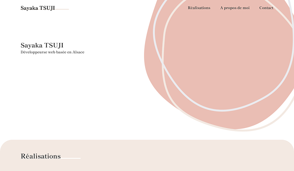
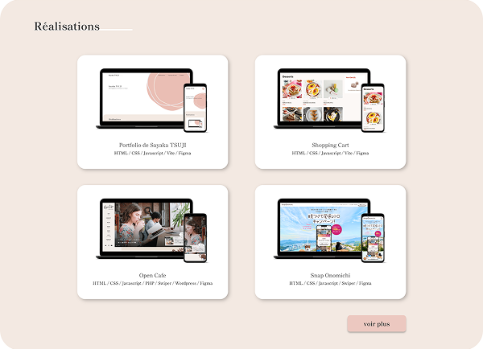
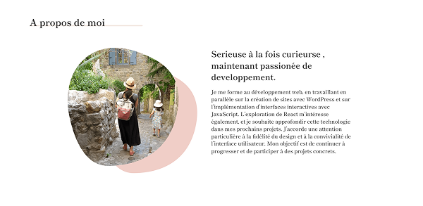

# Mon Portfolio

Bienvenue sur mon portfolio !  
Ce site présente mes projets et compétences en développement web, principalement orientés vers le front-end.

---

## 🌐 Site

[👉 Voir le site](https://sayakatsuji.com/)

---

## ⚙️ Technologies utilisées

- HTML / CSS / SCSS
- JavaScript
- Vite
- WordPress

---

## 📂 Projets

- **shopping cart** : Un site e-commerce avec un panier développé en Vanilla.js (projet fictif)
- **Open Cafe** :Un site vitrine pour un café réalisé avec WordPress (projet fictif)
- **Snap Onomichi** : Une landing page pour un concours photo sur les réseaux sociaux (projet fictif)

---

## 📸 Captures d’écran

| Section Réalisation             | Section à propos de moi         |
| ------------------------------- | ------------------------------- |
|  |  |

---

## 📜 Dépôt GitHub

[Voir ce dépôt](https://github.com/sayaka68/portfolio/tree/main)
